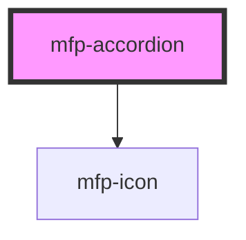

# mfp-accordion

<!-- Auto Generated Below -->

## Properties

| Property      | Attribute      | Description                                                                                                                                                     | Type                  | Default    |
| ------------- | -------------- | --------------------------------------------------------------------------------------------------------------------------------------------------------------- | --------------------- | ---------- |
| `appearance`  | `appearance`   | The appearance style of accordion                                                                                                                               | `"filled" \| "ghost"` | `'filled'` |
| `disabled`    | `disabled`     | If true accordion is disabled                                                                                                                                   | `boolean`             | `false`    |
| `expanded`    | `expanded`     | If true accordion is expanded                                                                                                                                   | `boolean`             | `false`    |
| `noAnimation` | `no-animation` | Animation is set through JS when the browser does not support CSS calc-size() If true, the accordion animation, will be disabled. No animation will be applied. | `boolean`             | `false`    |
| `rotate`      | `rotate`       | If true accordion expand icon is rotate 180deg when expanded                                                                                                    | `boolean`             | `false`    |
| `size`        | `size`         | The size of accordion                                                                                                                                           | `"medium" \| "small"` | `'medium'` |

## Events

| Event           | Description                                         | Type                                   |
| --------------- | --------------------------------------------------- | -------------------------------------- |
| `mfpAfterClose` | Handler to be called after the accordion is closed  | `CustomEvent<HTMLMfpAccordionElement>` |
| `mfpAfterOpen`  | Handler to be called after the accordion is opened  | `CustomEvent<HTMLMfpAccordionElement>` |
| `mfpBlur`       | Handler to be called when the accordion loses focus | `CustomEvent<HTMLMfpAccordionElement>` |
| `mfpClose`      | Handler to be called when the accordion is closed   | `CustomEvent<HTMLMfpAccordionElement>` |
| `mfpFocus`      | Handler to be called when the accordion gets focus  | `CustomEvent<HTMLMfpAccordionElement>` |
| `mfpOpen`       | Handler to be called when the accordion is opened   | `CustomEvent<HTMLMfpAccordionElement>` |

## Shadow Parts

| Part       | Description                                                    |
| ---------- | -------------------------------------------------------------- |
| `"base"`   | The `
` that holds the accordion content               |
| `"header"` | The `
` that holds the accordion header content        |
| `"panel"`  | The `
` that holds the accordion panel content             |
| `"prefix"` | The `
` that holds the accordion text prefix icon / avatar |
| `"suffix"` | The `
` that holds the accordion text suffix icon          |
| `"text"`   | The `
` that holds the accordion header text               |

## Dependencies

### Depends on

- [mfp-icon](../icon)

### Graph

----------------------------------------------

*Built with [StencilJS](https://stenciljs.com/)*
