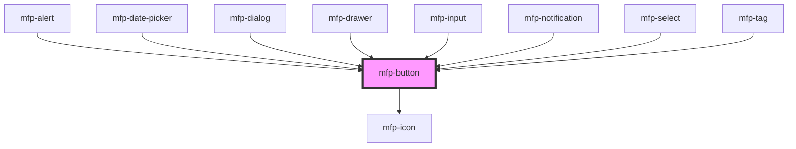

# mfp-button

<!-- Auto Generated Below -->

## Overview

Buttons are designed for users to take action on a page or a screen.

## Properties

| Property         | Attribute         | Description                                                                                                                                                                             | Type                                                     | Default      |
| ---------------- | ----------------- | --------------------------------------------------------------------------------------------------------------------------------------------------------------------------------------- | -------------------------------------------------------- | ------------ |
| `appearance`     | `appearance`      | The appearance style to apply to the button                                                                                                                                             | `"link" \| "primary" \| "secondary" \| "text"`           | `'primary'`  |
| `block`          | `block`           | If `true`, it will make the button fit to its parent width.                                                                                                                             | `boolean`                                                | `false`      |
| `border`         | `border`          | The corner radius of the button                                                                                                                                                         | `"full" \| "l" \| "m" \| "none" \| "s" \| "xs" \| "xs2"` | `'m'`        |
| `disabled`       | `disabled`        | If true, the button will be disabled (no interaction allowed)                                                                                                                           | `boolean`                                                | `false`      |
| `download`       | `download`        | Tells the browser to treat the linked URL as a download. Only used when `href` is set. Details: https://developer.mozilla.org/en-US/docs/Web/HTML/Element/a#attr-download               | `string`                                                 | `undefined`  |
| `href`           | `href`            | When set, the underlying button will be rendered as an `<a>` with this `href` instead of a `<button>`                                                                                   | `string`                                                 | `undefined`  |
| `justifyContent` | `justify-content` | It determinate how the content should be aligned                                                                                                                                        | `"center" \| "left" \| "right"`                          | `'center'`   |
| `loading`        | `loading`         | If `true` it will display the button in a loading state                                                                                                                                 | `boolean`                                                | `false`      |
| `size`           | `size`            | The size of the button                                                                                                                                                                  | `"large" \| "medium" \| "small"`                         | `'medium'`   |
| `target`         | `target`          | Where to display the linked URL, as the name for a browsing context (a `tab`, `window`, or `<iframe>`) Details: https://developer.mozilla.org/en-US/docs/Web/HTML/Element/a#attr-target | `"_blank" \| "_parent" \| "_self" \| "_top"`             | `undefined`  |
| `type`           | `type`            | The default behavior of the button                                                                                                                                                      | `"button" \| "reset" \| "submit"`                        | `'button'`   |
| `variant`        | `variant`         | The variant of button to apply on top of the appearance (applicable only to `appearance="primary"`)                                                                                     | `"danger" \| "ghost" \| "standard"`                      | `'standard'` |

## Events

| Event      | Description                                      | Type                                |
| ---------- | ------------------------------------------------ | ----------------------------------- |
| `mfpBlur`  | Handler to be called when the button loses focus | `CustomEvent<HTMLMfpButtonElement>` |
| `mfpClick` | Handler to be called when button gets focus      | `CustomEvent<HTMLMfpButtonElement>` |
| `mfpFocus` | Handler to be called when the button is clicked  | `CustomEvent<HTMLMfpButtonElement>` |

## Shadow Parts

| Part       | Description                                                   |
| ---------- | ------------------------------------------------------------- |
| `"button"` | The `<a>` or `<button>` HTML element used under the hood.     |
| `"label"`  | The `` tag element that renders the text of the button. |
| `"prefix"` | The `` tag element that acts as prefix container.       |
| `"suffix"` | The `` tag element that acts as suffix container.       |

## Dependencies

### Used by

 - [mfp-alert](../alert)
 - [mfp-date-picker](../date-picker)
 - [mfp-dialog](../dialog)
 - [mfp-drawer](../drawer)
 - [mfp-input](../input)
 - [mfp-notification](../notification)
 - [mfp-select](../select)
 - [mfp-tag](../tag)

### Depends on

- [mfp-icon](../icon)

### Graph

----------------------------------------------

*Built with [StencilJS](https://stenciljs.com/)*
