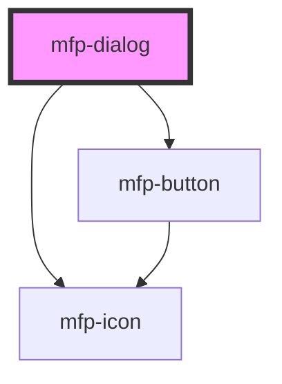

# mfp-dialog

<!-- Auto Generated Below -->

## Properties

| Property                   | Attribute                     | Description                                                              | Type                                                     | Default      |
| -------------------------- | ----------------------------- | ------------------------------------------------------------------------ | -------------------------------------------------------- | ------------ |
| `border`                   | `border`                      | Corder radius of the dialog component                                    | `"full" \| "l" \| "m" \| "none" \| "s" \| "xs" \| "xs2"` | `'m'`        |
| `disableBackdrop`          | `disable-backdrop`            | If true, the backdrop overlay won't be shown when the dialog opens       | `boolean`                                                | `false`      |
| `disableCloseClickOutside` | `disable-close-click-outside` | If true, the dialog will not close when clicking on the backdrop overlay | `boolean`                                                | `false`      |
| `disableCloseEscKeydown`   | `disable-close-esc-keydown`   | If true, the dialog will not close when the [Esc] key is press           | `boolean`                                                | `false`      |
| `footerAppearance`         | `footer-appearance`           | The appearance of footer                                                 | `"highlight" \| "standard"`                              | `'standard'` |
| `hideCloseButton`          | `hide-close-button`           | If true, it hides the close button                                       | `boolean`                                                | `false`      |
| `open`                     | `open`                        | If true, the dialog will be shown as open                                | `boolean`                                                | `false`      |
| `size`                     | `size`                        | The size of the dialog                                                   | `"large" \| "medium" \| "small"`                         | `'medium'`   |

## Events

| Event           | Description                                                             | Type                |
| --------------- | ----------------------------------------------------------------------- | ------------------- |
| `mfpAfterClose` | Callback handler emitted when the dialog finish closing                 | `CustomEvent<void>` |
| `mfpAfterOpen`  | Callback handler emitted when the dialog finish opening                 | `CustomEvent<void>` |
| `mfpCancel`     | Callback handler emitted when the dialog has been canceled or dismissed | `CustomEvent<void>` |
| `mfpClose`      | Callback handler emitted when the dialog will close                     | `CustomEvent<void>` |
| `mfpOpen`       | Callback handler emitted when the dialog will open                      | `CustomEvent<void>` |

## Methods

### `cancel() => Promise<void>`

Dismiss or cancel the dialog

#### Returns

Type: `Promise<void>`

### `hide() => Promise<void>`

Closes the dialog

#### Returns

Type: `Promise<void>`

### `show() => Promise<void>`

Open the dialog

#### Returns

Type: `Promise<void>`

## Shadow Parts

| Part             | Description                                                             |
| ---------------- | ----------------------------------------------------------------------- |
| `"body"`         | The `<main>` that holds the dialog body content                         |
| `"button-close"` | The button that close the dialog on click                               |
| `"content"`      | The `
` container that holds the dialog title and body content      |
| `"dialog"`       | The `<dialog>` wrapper container inside the shadow DOM                  |
| `"footer"`       | The `<footer>` that holds footer content                                |
| `"header"`       | The `<header>` that holds the icon, title, description and close button |
| `"title"`        | The `
` that holds the title content                                |

## Dependencies

### Depends on

- [mfp-button](../button)
- [mfp-icon](../icon)

### Graph

----------------------------------------------

*Built with [StencilJS](https://stenciljs.com/)*
