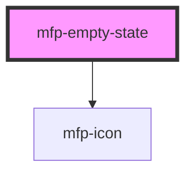

# mfp-empty-state

<!-- Auto Generated Below -->

## Properties

| Property | Attribute | Description                           | Type                             | Default    |
| -------- | --------- | ------------------------------------- | -------------------------------- | ---------- |
| `size`   | `size`    | The size of the empty state component | `"large" \| "medium" \| "small"` | `'medium'` |

## Shadow Parts

| Part          | Description                                                                                                         |
| ------------- | ------------------------------------------------------------------------------------------------------------------- |
| `"body"`      | The container `
` that wraps the alert description content                                                      |
| `"footer"`    | The container `
` that wraps the alert footer content                                                           |
| `"icon"`      | The `<mfp-icon>` element used to render a predefined icon size based on the empty state size (small, medium, large) |
| `"thumbnail"` | The container `
` that wraps the thumbnail element                                                              |
| `"title"`     | The container `
` that wraps the empty state title content                                                      |
| `"wrapper"`   | The wrapper container `
` of the element inside the shadow DOM                                                  |

## Dependencies

### Depends on

- [mfp-icon](../icon)

### Graph

----------------------------------------------

*Built with [StencilJS](https://stenciljs.com/)*
