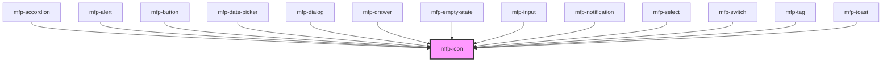

# mfp-icon

<!-- Auto Generated Below -->

## Overview

Icons are simplified images that graphically explain the meaning of an object on the screen.

## Properties

| Property            | Attribute | Description                                                                             | Type                                                              | Default     |
| ------------------- | --------- | --------------------------------------------------------------------------------------- | ----------------------------------------------------------------- | ----------- |
| `color`             | `color`   | Set the stroke color of the SVG. The value should be a valid value of the palette color | `string`                                                          | `undefined` |
| `label`             | `label`   | Label for the icon, used for accessibility                                              | `string`                                                          | `undefined` |
| `name` _(required)_ | `name`    | Icon name to load. Please check all available icons [here](https://phosphoricons.com/)  | `string`                                                          | `undefined` |
| `size`              | `size`    | Set the size of the SVG                                                                 | `number \| string`                                                | `24`        |
| `src`               | `src`     | Set the source of the SVG. If the source is set, the name property will be ignored      | `string`                                                          | `undefined` |
| `weight`            | `weight`  | **[DEPRECATED]** It set the icon weight/style    | `"bold" \| "duotone" \| "fill" \| "light" \| "regular" \| "thin"` | `undefined` |

## Events

| Event       | Description                                           | Type               |
| ----------- | ----------------------------------------------------- | ------------------ |
| `svgLoaded` | Callback handler to be called when the SVG has loaded | `CustomEvent<any>` |

## Shadow Parts

| Part     | Description                                                       |
| -------- | ----------------------------------------------------------------- |
| `"base"` | The component's internal wrapper that holds the icon SVG content. |
| `"svg"`  | The `<svg>` tag element inside the component.                     |

## Dependencies

### Used by

 - [mfp-accordion](../accordion)
 - [mfp-alert](../alert)
 - [mfp-button](../button)
 - [mfp-date-picker](../date-picker)
 - [mfp-dialog](../dialog)
 - [mfp-drawer](../drawer)
 - [mfp-empty-state](../empty-state)
 - [mfp-input](../input)
 - [mfp-notification](../notification)
 - [mfp-select](../select)
 - [mfp-switch](../switch)
 - [mfp-tag](../tag)
 - [mfp-toast](../toast)

### Graph

----------------------------------------------

*Built with [StencilJS](https://stenciljs.com/)*
