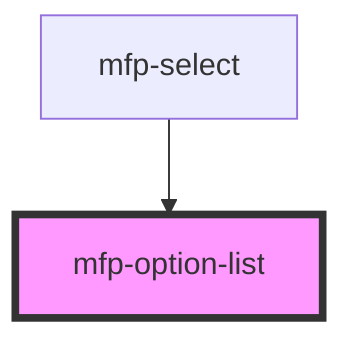

# mfp-option-list

<!-- Auto Generated Below -->

## Properties

| Property    | Attribute    | Description              | Type     | Default     |
| ----------- | ------------ | ------------------------ | -------- | ----------- |
| `ariaLabel` | `aria-label` | Aria label for the list. | `string` | `'Options'` |

## Events

| Event       | Description                                                                | Type                                                          |
| ----------- | -------------------------------------------------------------------------- | ------------------------------------------------------------- |
| `mfpSelect` | Handler to be called when `mfp-option` is selected (on click/enter press). | `CustomEvent<{ value: string; item: HTMLMfpOptionElement; }>` |

## Shadow Parts

| Part     | Description                       |
| -------- | --------------------------------- |
| `"base"` | The component's internal wrapper. |

## Dependencies

### Used by

 - [mfp-select](../select)

### Graph

----------------------------------------------

*Built with [StencilJS](https://stenciljs.com/)*
